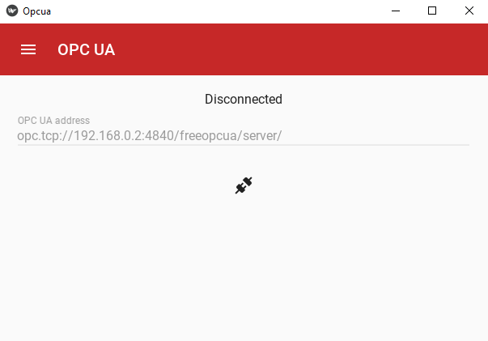

# OPC-UA-App-with-S7-1200-Server
This is an application presenting the possibilities of Industry 4.0. 
The app is created using kivy and kivy-md frameworks, which makes it multi-platform usable.
Features:
- connect to any OPC UA server
- download data from the server, store in in .csv file and load from .csv
- control inverter connected to the plc

